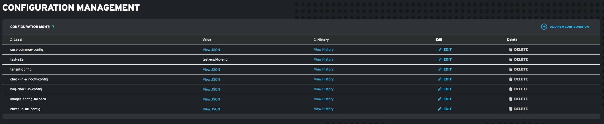
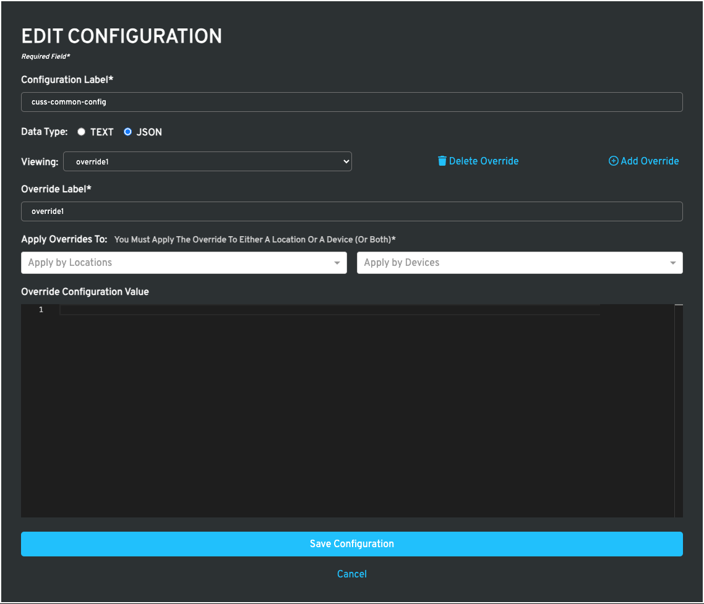

# Elevation Lib Core

<div align="center">
  <h3>🚀 Comprehensive TypeScript SDK for Elevated Platform Services</h3>
  <p>Real-time reporting, bidirectional communication, and remote logging for touchpoint devices</p>
  
  [](https://www.npmjs.com/package/@elevationai/elevation-core-ts)
  [](https://www.typescriptlang.org/)
  [](LICENSE)
</div>

---

## 📋 Table of Contents

- [Overview](#overview)
- [Features](#features)
- [Installation](#installation)
- [Quick Start](#quick-start)
- [Core Modules](#core-modules)
  - [Logging](#logging)
  - [Events](#events)
  - [IOT](#iot)
  - [Device Enrollment](#device-enrollment)
  - [Configuration Management](#configuration-management)
- [API Documentation](#api-documentation)
- [Examples](#examples)
- [Change Log](#change-log)
- [Support](#support)

## Overview

The **Elevation Lib Core** library provides comprehensive access to all Elevated Platform core services, enabling seamless integration with the Elevated ecosystem for device management, monitoring, and analytics. In order to interact with the library, developers must acquire an organization token and a service endpoint. For more information, please contact Elevation Software at [blndspt.com](https://www.blndspt.com/reach-out/).

🏢 **Admin Dashboard Interface**

### Key Capabilities

- **🔄 Real-time Communication**: Bidirectional socket connections for instant device control
- **📊 Event Tracking**: Comprehensive event system with 200+ predefined event codes
- **📝 Centralized Logging**: Remote log aggregation with multiple severity levels
- **🔐 Device Enrollment**: Secure device registration and authentication
- **⚙️ Configuration Management**: Dynamic configuration updates with location/device overrides
- **🎯 Debouncing**: Built-in event and log debouncing to prevent flooding

## Features

Within the core library exists 5 different sub-libraries created to provide access and assist with the communication of the core Elevated Platform Services (EPS):

- **[Logging](#logging)** - Centralized log aggregation and monitoring
- **[Events](#events)** - Event tracking and analytics
- **[IOT](#iot)** - Real-time bidirectional communication
- **[Device Enrollment](#device-enrollment)** - Device registration and configuration
- **[Configuration Management](#configuration-management)** - Dynamic configuration with overrides

## Installation

In order to install the @elevationai/elevation-core-ts you are going to need npm access. If you have all the required configuration files, just run the installation command from the working directory.

### NPM
```bash
npm install @elevationai/elevation-core-ts
```

### Yarn
```bash
yarn add @elevationai/elevation-core-ts
```

## Core Communication

Every sub-library requires specific information needed to communicate with EPS. Each EPS tenant would have a unique access token and endpoint service which are going to be used during the instantiation of each core sub-library. The interface for the core communication is called CoreInfo.

```typescript
interface CoreInfo {
    token: string;
    serviceEndpoint: string;
    iotEndpoint?: string;       // Required for IOT
    fingerPrint?: string;        // Required for IOT/Enrollment
    secondary?: boolean;         // Optional for secondary apps
}
```

### Defining CoreInfo in code

```typescript
import { CoreInfo } from '@elevationai/elevation-core-ts';

const coreInfo: CoreInfo = {
    token: '<Tenant_Access_Token>',
    serviceEndpoint: 'https://api-kiosk-elevation.herokuapp.com' // Test Endpoint
};
```

---

# Logging

EPS provides the facility to centralize all the device's logs within the Administration Panel Interface. Users can access individual device logs through a widget located in the device details page. Logs are displayed in chronological order and can be filtered based on the available log levels.

📊 **Centralized Logging Dashboard**

## Content
 - [Configuration](#configuring-logs)
 - [Singleton Instance](#log-singleton-instance)
 - [Class Instantiation](#log-class-instantiation)
 - [Sending Logs](#sending-logs)
 - [Logs Schema](#log-schema)
 - [Log Levels](#log-levels)
 - [Setting logs defaults](#setting-logs-defaults)
 - [Log Helpers](#log-helpers)
 - [Log Debounce](#log-debounce)

## Configuring logs

In order to start interacting with the library, you first need to configure the core information data, using a singleton instance of the library or an instantiated instance from the main class.

### Log Singleton Instance
The singleton instance is the most common way a developer will interact with the library.

```typescript
import { elogs, CoreInfo } from '@elevationai/elevation-core-ts';

const coreInfo: CoreInfo = {
    token: '<Tenant_Access_Token>',
    serviceEndpoint: 'https://api-kiosk-elevation.herokuapp.com' // Test Endpoint
};

// passing connection data to the library before calling any method
elogs.config(coreInfo);
```

### Log Class Instantiation

In rare occasions, a developer could have multiple services endpoints and they will want the facility to simultaneously send logs to all available environments. For that particular case, you can instantiate multiple instances of the log library.

```typescript
import { ElevatedLogs, CoreInfo } from '@elevationai/elevation-core-ts';

const coreInfo1: CoreInfo = {
    token: '<Tenant_Access_Token>',
    serviceEndpoint: 'https://api-kiosk-elevation.herokuapp.com' // Test Endpoint
};

const coreInfo2: CoreInfo = {
    token: '<Tenant_Access_Token>',
    serviceEndpoint: 'https://<prod-url>' // Prod Endpoint
};

// passing connection data to the library before calling any method
const elogs1 = new ElevatedLogs(coreInfo1);
const elogs2 = new ElevatedLogs(coreInfo2);
```

## Sending logs

After having an understanding of how to configure the log library, now you are ready to send log information to EPS. Each log request should be associated to a unique touchpoint or device, therefore, the use of a deviceID is required in order to send log messages to EPS.

The log message schema should allow developers to add enough information about the particular circumstance they are trying to track.

### Log Schema
```typescript 
export interface LogData {
    applicationName?: string;
    level?: LogLevel;
    message: string;
    deviceId: string;
    url?: string;
    body?: string;
    statusCode?: number;
}
```

Now in order to send logs, you just use the message function.

```typescript
import { elogs, CoreInfo, LogLevel } from '@elevationai/elevation-core-ts';

const coreInfo: CoreInfo = {
    token: '<Tenant_Access_Token>',
    serviceEndpoint: 'https://api-kiosk-elevation.herokuapp.com' // Test Endpoint
};

// passing connection data to the library before calling any method
elogs.config(coreInfo);

elogs.message({
    applicationName: 'MyAwesomeApp',
    level: LogLevel.INFO,
    message: 'Application started',
    deviceId: '<Device-GUID>',
    url: 'Your App url', // optional
    body: 'Request Body', // optional
    statusCode: 0 // optional
})
.then(() => console.log('Log message sent'));
```

### Log Levels
Currently the library supports 4 different log levels, but if you required an extra level of separation between different events within your application lifecycle, you should make use of the statusCode, from which you can assign any proprietary number definition.

```typescript
export enum LogLevel {
    INFO = 0,
    DELAYED = 1,
    ERROR = 2,
    CRITICAL = 3
}
```

### Setting logs defaults

In order to improve productivity during the development process, you can set the value of properties that don't change often when you are sending log messages to EPS. For that particular case, you can make use of the setDefaults function. This function allows you to avoid setting values every time you need to send a log message.

```typescript
import { elogs, CoreInfo, LogLevel, LogOptions } from '@elevationai/elevation-core-ts';

const coreInfo: CoreInfo = {
    token: '<Tenant_Access_Token>',
    serviceEndpoint: 'https://api-kiosk-elevation.herokuapp.com' // Test Endpoint
};

const logDefaults: LogOptions = {
    debounce: 1000 * 10, // 10 seconds debounce time
    deviceId: '<Device-GUID>', // Optional
    applicationName: 'MyAwesomeApp', // Optional
    statusCode: 0 // Optional
};

// passing connection data to the library before calling any method
elogs.config(coreInfo);

// setting default values
elogs.setDefaults(logDefaults);

// now only pass the information that is not part of the defaults
elogs.message({
    level: LogLevel.INFO,
    message: 'Application started',
})
.then(() => console.log('Log message sent'));
```

### Log helpers

In order to improve productivity even more, we provide log helpers to make the logging coding process self-explanatory. In conjunction with default values, the log helpers are incredibly useful during the development process. There is one helper function for each LogLevel in the library.

```typescript
elogs.information({ message: 'Application started' });

elogs.delayed({ 
    url: 'https://app_api/submit',
    message: 'Request took longer than default values'
});

elogs.error({ message: 'Unable to submit request' });

elogs.critical({ message: 'Unable to connect to db' });
```

### Log Debounce

In many occasions a particular situation would trigger the firing of a vast amount of logs to the EPS, making the process of searching a specific issue much more difficult. That is why you have the ability to define a debounce value in milliseconds. By setting a debounce value, you will prevent the logs library from sending multiple log messages within the constraint of the debounce time chosen.

```typescript
import { elogs, CoreInfo, LogLevel, LogOptions } from '@elevationai/elevation-core-ts';

const coreInfo: CoreInfo = {
    token: '<Tenant_Access_Token>',
    serviceEndpoint: 'https://api-kiosk-elevation.herokuapp.com' // Test Endpoint
};

const logDefaults: LogOptions = {
    debounce: 1000 * 10, // 10 seconds debounce time
    deviceId: '<Device-GUID>', // Optional
    applicationName: 'MyAwesomeApp', // Optional
    statusCode: 0 // Optional
};

// passing connection data to the library before calling any method
elogs.config(coreInfo);

// setting default values
elogs.setDefaults(logDefaults);

// This is going to be sent
elogs.information({ message: 'Sending message' });

// This won't reach the server
elogs.information({ message: 'Never is going to reach the EPS' }); 
```

---

# Events

Events are one of the most important elements of EPS, because it drives the information presented in the Administrator dashboard UI. There are some predefined events ready to use in a custom application, and can even be sent automatically within a CUSS deployment through the use of the elevated-analytics library.

📈 **Event Analytics Dashboard**

## Content
 - [Configuring Events](#configuring-events)
 - [Events Singleton Instance](#events-singleton-instance)
 - [Events Class Instantiation](#events-class-instantiation)
 - [Sending Events](#sending-events)
 - [Events Schema](#events-schema)
 - [Event Codes](#event-codes)
 - [Event Status Codes](#event-status-codes)
 - [Setting Event Defaults](#setting-event-defaults)
 - [Event Helpers](#event-helpers)
 - [Event Debounce](#event-debounce)

## Configuring Events

In order to start interacting with the library, you first need to configure the core information data, using a singleton instance of the library or an instantiated instance from the main class.

### Events Singleton Instance
The singleton instance is the most common way a developer will interact with the library.

```typescript
import { events, CoreInfo } from '@elevationai/elevation-core-ts';

const coreInfo: CoreInfo = {
    token: '<Tenant_Access_Token>',
    serviceEndpoint: 'https://api-kiosk-elevation.herokuapp.com' // Test Endpoint
};

// passing connection data to the library before calling any method
events.config(coreInfo);
```

### Events Class Instantiation

In rare occasions, a developer could have multiple services endpoints and they will want the facility to simultaneously send events to all available environments. For that particular case, you can instantiate multiple instances of the event library.

```typescript
import { ElevatedEvents, CoreInfo } from '@elevationai/elevation-core-ts';

const coreInfo1: CoreInfo = {
    token: '<Tenant_Access_Token>',
    serviceEndpoint: 'https://api-kiosk-elevation.herokuapp.com' // Test Endpoint
};

const coreInfo2: CoreInfo = {
    token: '<Tenant_Access_Token>',
    serviceEndpoint: 'https://<prod-url>' // Prod Endpoint
};

// passing connection data to the library before calling any method
const events1 = new ElevatedEvents(coreInfo1);
const events2 = new ElevatedEvents(coreInfo2);
```

## Sending events

In order to send events to the EPS, you need to use the send function from the library passing the correct event data structure needed to create one.

### Events schema

```typescript
export interface EventData {
    eventCode?: EventCode | number;
    eventType?: EventType;
    eventMode?: EventMode;
    eventData: any;
    ownerID?: string;
    statusCode?: StatusCode;
    created?: Date;
}
```

Now you are ready to send an event to EPS.

```typescript
import { 
    events,
    CoreInfo,
    EventCode,
    EventType,
    EventMode,
    StatusCode
} from '@elevationai/elevation-core-ts';

const coreInfo: CoreInfo = {
    token: '<Tenant_Access_Token>',
    serviceEndpoint: 'https://api-kiosk-elevation.herokuapp.com' // Test Endpoint
};

// passing connection data to the library before calling any method
events.config(coreInfo);

events.send({
    eventCode: EventCode.BAGTAG_PRINT,
    eventType: EventType.CHECKIN_KIOSK,
    eventMode: EventMode.CUSS,
    eventData: { PNR: 'ABC123', airline: 'AA' },
    ownerID: 'xxxx-xxxx-xxxx-xxxx', // Device GUID
    statusCode: StatusCode.SUCCESS
})
.then(() => console.log('Event sent'));
```

### Event Codes
There are over 200 predefined event codes within the library but that should not be a limitation on how developers can describe or capture activities in their applications. Through the Administrator UI settings, developers are able to create their own custom event codes, to better represent their application eventing system.

⚙️ **Custom Event Configuration**

### Event Status Codes
Each status code represents a way to filter events in the Administrator UI.  
```typescript
export enum StatusCode {
    SUCCESS = 200,
    MODE_CHANGE = 300,
    FAILURE = 400,
    CRITICAL_FAILURE = 500,
    INFRACTION = 501,
    TIMEOUT = 502
}
```

### Setting event defaults
There are many situations when developers want to streamline the consumption of the library in their code base. That is why you can define default values that are not likely to change when you are sending events to the EPS.

Most of the time the values that rarely change are eventMode, eventType, and ownerID.

```typescript 
import { EventOptions, CoreInfo, events, EventType, EventMode } from '@elevationai/elevation-core-ts';

const coreInfo: CoreInfo = {
    token: '<Tenant_Access_Token>',
    serviceEndpoint: 'https://api-kiosk-elevation.herokuapp.com' // Test Endpoint
};

const defaultValues: EventOptions = {
    eventType: EventType.CHECKIN_KIOSK, // Optional
    eventMode: EventMode.CUSS, // Optional
    ownerID: 'xxxx-xxxx-xxxx-xxxx', // Device GUID, optional
};

// passing connection data to the library before calling any method
events.config(coreInfo);

// setting default values
events.setDefaults(defaultValues);

// Now just pass what is not in the default values
events.send({
    eventCode: EventCode.BAGTAG_PRINT,
    eventData: { PNR: 'ABC123', airline: 'AA' },
    statusCode: StatusCode.SUCCESS
})
.then(() => console.log('Event sent'));
```

### Event Helpers

To improve the development process the library provides a helper function for each statusCode type available.

```typescript
events.success({ eventCode: EventCode.BAGTAG_PRINT });

events.failure({ eventCode: EventCode.BAGTAG_PRINT });

events.error({ eventCode: EventCode.OFFLINE });

events.critical({ eventCode: EventCode.OUT_OF_SERVICE });

events.infraction({ eventCode: EventCode.UPPER_DOOR_OPEN });

events.timeout({ eventCode: EventCode.RESERVATION_NOT_FOUND });
```

### Event Debounce
In many occasions a particular situation would trigger the firing of a vast amount of events to the EPS, making the process of reporting much more difficult and in some cases inaccurate. That is why you have the ability to define a debounce value in milliseconds on a per eventCode basis. By setting a debounce value, you will prevent the event library from sending multiple events of the specified event-code within the constraint of the debounce time chosen.

```typescript 
import { EventOptions, CoreInfo, events, EventType, EventMode, EventCode } from '@elevationai/elevation-core-ts';

const coreInfo: CoreInfo = {
    token: '<Tenant_Access_Token>',
    serviceEndpoint: 'https://api-kiosk-elevation.herokuapp.com' // Test Endpoint
};

// Debouncing all paper jams to 1 minute
const defaultValues: EventOptions = {
    debounceEvent: [{eventCode: EventCode.PAPER_JAM, debounce: 1000*60 }], // Optional
    eventType: EventType.CHECKIN_KIOSK, // Optional
    eventMode: EventMode.CUSS, // Optional
    ownerID: 'xxxx-xxxx-xxxx-xxxx', // Device GUID, optional
};

// passing connection data to the library before calling any method
events.config(coreInfo);

// setting default values
events.setDefaults(defaultValues);

// This event will be send
events.error({ eventCode: EventCode.PAPER_JAM });

// This will be debounced
events.error({ eventCode: EventCode.PAPER_JAM });
```

There is a chance that you might want to debounce a particular event only once.

```typescript
// Debouncing in service event once for 1 minute
const defaultValues: EventOptions = {
    debounceOnce: [{eventCode: EventCode.IN_SERVICE, debounce: 1000*60 }],
    ...
};
```

---

# IOT

The internet of things, provided by EPS, enables applications running anywhere to establish a bidirectional channel of communication with the Administrator UI. This enables the end user to command the customer facing UI in real time.

## Content
 - [Important Notice](#important-notice)
 - [FingerPrint](#fingerprint)
 - [Configuring IOT](#configuring-iot)
 - [IOT Singleton Instance](#iot-singleton-instance)
 - [IOT Class Instantiation](#iot-class-instantiation)
 - [IOT Event Handling](#iot-event-handling)

### Important notice
Unlike the other libraries, IOT requires the iotEndpoint and a fingerPrint to be defined within the CoreInfo Object. Without it, the communication between the device and EPS won't be possible. 

```typescript
interface CoreInfo {
    token: string;
    serviceEndpoint: string;
    iotEndpoint?: string;
    fingerPrint?: string;
}
```

### FingerPrint
In order to associate events and logs to specific devices anywhere in the world, EPS requires a form of identification that must be unique per device. Many applications would take the MAC Address of a device as a good fingerprint value, or an auto generated GUID that gets saved to the operating system, and retrieved and sent to EPS every time the application establishes a bidirectional channel.

There is a helper function in the core library that facilitates the creation of GUID, and it can be accessed directly.

```typescript
import { uuid } from '@elevationai/elevation-core-ts';

console.log(uuid()); // example response: e91f29b3-3559-491c-ab43-05c63ddc08f9
```

## Configuring IOT

In order to start interacting with the library, you first need to configure the core information data, using a singleton instance of the library or an instantiated instance from the main class. In addition, developers can specify the application name that is making the connection and the version number. If none are provided, the default values would be an empty string for the application name and 0.0.0 for the version number. Passing the optional `secondary: true` designates the application as a secondary application, meaning it will not update the status of the device in the Administrator UI.

### IOT Singleton Instance
The singleton instance is the most common way developers will interact with the library.

```typescript
import { iot, CoreInfo, IOTInfo } from '@elevationai/elevation-core-ts';

const coreInfo: CoreInfo = {
    token: '<Tenant_Access_Token>',
    serviceEndpoint: 'https://api-kiosk-elevation.herokuapp.com', // Test Endpoint
    iotEndpoint: 'https://<app-iot-endpoint>',
    fingerPrint: '<App-GUID>', // unique per touchpoint
    secondary: false // Optional
};

// optional information
const iotInfo: IOTInfo = {
    appName: 'airlineCheckinApp',
    appVersion: '0.1.0'
};

// passing connection data to the library before calling any method
iot.config(coreInfo, iotInfo);

// successfully connected to EPS IOT services
iot.onConnected.subscribe(() => {
    console.log('Connection succeeded');
});

// Device configuration is required
iot.onConfigRequired.subscribe(() => {
    console.log('App configuration must be completed to connect');
});
```

### IOT Class Instantiation
In rare occasions, developers could have multiple services endpoints and they will want the facility to simultaneously connect to all available IOT environments. For that particular case, you can instantiate multiple instances of the IOT library.

```typescript
import { ElevatedIOT, CoreInfo, IOTInfo } from '@elevationai/elevation-core-ts';

const coreInfo1: CoreInfo = {
    token: '<Tenant_Access_Token>',
    serviceEndpoint: 'https://api-kiosk-elevation.herokuapp.com', // Test Endpoint
    iotEndpoint: 'https://<app-iot-endpoint>',
    fingerPrint: '<App-GUID>', // unique per touchpoint
    secondary: false // Optional
};

const coreInfo2: CoreInfo = {
    token: '<Tenant_Access_Token>',
    serviceEndpoint: 'https://<api-2-endpoint>', // Test Endpoint
    iotEndpoint: 'https://<app-iot-endpoint2>',
    fingerPrint: '<App-GUID>', // unique per touchpoint
    secondary: false // Optional
};

// optional information
const iotInfo: IOTInfo = {
    appName: 'airlineCheckinApp',
    appVersion: '0.1.0'
};

// passing connection data to the library before calling any method
const iot1 = new ElevatedIOT(coreInfo1);
const iot2 = new ElevatedIOT(coreInfo2);

// successfully connected to EPS IOT services
iot1.onConnected.subscribe(() => {
    console.log('Connection 1 succeeded');
});
iot2.onConnected.subscribe(() => {
    console.log('Connection 2 succeeded');
});

// Device configuration is required
iot1.onConfigRequired.subscribe(() => {
    console.log('App configuration 1 must be completed to connect');
});
iot2.onConfigRequired.subscribe(() => {
    console.log('App configuration 2 must be completed to connect');
});
```

### IOT event handling
There are 4 major events in the IOT lifecycle; and it is important to understand how to deal with each one accordingly.

 - [onConnected](#iot-onconnected)
 - [onDisconnected](#iot-ondisconnected)
 - [onConfigRequired](#iot-onconfigrequired)
 - [onCommand](#iot-oncommand)

### IOT onConnected
This rxjs subscription gets triggered as soon as the application is able to validate that it is correctly configured on the Administrator UI and it has the correct credentials with the appropriate volume license. After you receive this subscription, your application is ready to start receiving communications from the outside world.

```typescript
import { iot, CoreInfo, IOTInfo } from '@elevationai/elevation-core-ts';

...

// successfully connected to EPS IOT services
iot.onConnected.subscribe(() => {
    console.log('Connection succeeded, application is ready to receive commands');
});
```

### IOT onDisconnected
This rxjs subscription gets triggered when the network connection between the application and the EPS IOT service gets disrupted.

```typescript
import { iot, CoreInfo, IOTInfo } from '@elevationai/elevation-core-ts';

...

// disconnected from EPS IOT services
iot.onDisconnect.subscribe(() => {
    console.log('Connection was disrupted, application cannot receive commands');
});
```

### IOT onConfigRequired
This rxjs subscription gets triggered when the application connects with a fingerprint never seen before by the IOT service. At this point, the application must go through a configuration process either from the Administrator UI or from the use of the subscription library.

```typescript
import { iot, CoreInfo, IOTInfo } from '@elevationai/elevation-core-ts';

...

// configuration required
iot.onConfigRequired.subscribe(() => {
    console.log('Connection did not succeed, application must go through the configuration process');
    // redirect app to the configuration page
    // or configure app in the Administrator UI
});
```

🔧 **Device Configuration Interface**

### IOT onCommand
This rxjs subscription enables the communication between the developer's application and the EPS IOT services, by making available a customizable set of device configuration values. Such configurations can be sent down to the applications from either the Administrator UI or external API, as long as they get predefined by the developer on the Custom Device Configurations screen.

💻 **Command Management Interface**

To handle commands in code, just subscribe to onCommand subject.

```typescript
import { iot, CoreInfo, IOTInfo } from '@elevationai/elevation-core-ts';

....

iot.onCommand.subscribe((command: Commands) => {
    if (command.showBagWaiver) {
        console.log('Display waiver to user');
    }
});
```

The commands can be manually sent through the device detail page on the Administrator UI.

📡 **Real-time Command Dispatch**

---

# Device Enrollment

In order to identify every single instance of applications/devices across the globe, developers must complete the enrollment process. This can be completed through the Administrator UI or just by simply providing the required information through the library.

## Content

- [Enrollment Configuration UI](#enrollment-configuration-ui)
- [FingerPrint](#enrollment-fingerprint)
- [Enrollment Configuration Code](#enrollment-configuration-code)
- [Enrollment Singleton Instance](#enrollment-singleton-instance)
- [Enrollment Class Instantiation](#enrollment-class-instantiation)
- [Starting Enrollment](#starting-enrollment)
- [Checking for Unique labels](#checking-for-unique-labels)

## Enrollment Configuration UI
🔐 **Device Enrollment Setup**

### Enrollment FingerPrint
Similar to the IOT library, in order to configure an instance of the enrollment service, developers must define a unique fingerprint that would identify a particular instance of an application or a physical device anywhere in the world. Many applications would take the MAC Address of a device as a good fingerprint value, or an auto generated GUID that gets saved to the operating system.

The core library provides a helper function to generate GUIDs
```typescript
import { uuid } from '@elevationai/elevation-core-ts';

console.log(uuid()); // example response: e91f29b3-3559-491c-ab43-05c63ddc08f9
```

## Enrollment Configuration Code
In order to start interacting with the library, you first need to configure the core information data, using a singleton instance of the library or an instantiated instance from the main class.

### Enrollment Singleton Instance
```typescript
import { enrollment, CoreInfo } from '@elevationai/elevation-core-ts';

const coreInfo: CoreInfo = {
    token: '<Tenant_Access_Token>',
    serviceEndpoint: 'https://api-kiosk-elevation.herokuapp.com', // Test Endpoint
    fingerPrint: '<App-GUID>' // unique per touchpoint
};

// passing connection data to the library before calling any method
enrollment.config(coreInfo);
```

### Enrollment Class Instantiation
In rare occasions, developers could have multiple services endpoints and they will want the facility to simultaneously enroll applications/devices to all available environments. 

```typescript
import { ElevatedEnrollment, CoreInfo } from '@elevationai/elevation-core-ts';

const coreInfo1: CoreInfo = {
    token: '<Tenant_Access_Token>',
    serviceEndpoint: 'https://api-kiosk-elevation.herokuapp.com', // Test Endpoint
    fingerPrint: '<App-GUID>' // unique per touchpoint
};

const coreInfo2: CoreInfo = {
    token: '<Tenant_Access_Token>',
    serviceEndpoint: 'https://<api2-url>', // Test Endpoint
    fingerPrint: '<App-GUID>' // unique per touchpoint
};

// passing connection data to the library before calling any method
const enroll1 = new ElevatedEnrollment(coreInfo1);
const enroll2 = new ElevatedEnrollment(coreInfo2);
```

## Starting Enrollment
To start the enrollment process, you will receive the current device object reference which you will use as a reference for the enrollment. Also, you are going to need to retrieve a reference of all available locations in the organization, terminal, and device specifications.

```typescript
import { 
    enrollment,
    CoreInfo,
    DeviceUpdate,
    DeviceLocation,
    Specification,
    DeviceInfo,
    enrollDevice 
} from '@elevationai/elevation-core-ts';

const coreInfo: CoreInfo = {
    token: '<Tenant_Access_Token>',
    serviceEndpoint: 'https://api-kiosk-elevation.herokuapp.com', // Test Endpoint
    fingerPrint: '<App-GUID>' // unique per touchpoint
};

// passing connection data to the library before calling any method
enrollment.config(coreInfo);

// Starting enrollment process
Promise.all([
    enrollment.start(),
    enrollment.getLocations(),
    enrollment.getSpecification()
]).then(async ([
    device: DeviceUpdate, 
    locations: DeviceLocation[], 
    specs: Specification[] 
]) => {

    // Creating a device object for enrollment
    const devObj: DeviceInfo = {
        label: 'DENKIOSK001', // a unique name
        device: device, // the device reference obtained from the start call
        location: locations[0], // the appropriate location
        terminal: locations[0]?.terminals[0],
        specification: specs[0]
    };
    
    await enrollment.enrollDevice(devObj); // Enrollment completed
});
```

### Checking for Unique labels
In order to avoid confusion in the Administrator UI, the library enforces that each enrolled device would have a unique name/label. To avoid errors during the enrollDevice call, the library provides a way to validate if the label or device name is available for use.

```typescript
import { enrollment, CoreInfo } from '@elevationai/elevation-core-ts';

const coreInfo: CoreInfo = {
    token: '<Tenant_Access_Token>',
    serviceEndpoint: 'https://api-kiosk-elevation.herokuapp.com', // Test Endpoint
    fingerPrint: '<App-GUID>' // unique per touchpoint
};

// passing connection data to the library before calling any method
enrollment.config(coreInfo);

// Checking for label availability
enrollment.isLabelAvailable('DENKIOSK001')
.then((isAvailable: boolean) => {
    if (isAvailable) {
        console.log('It is ok to use that label');
    }
});
```

---

# Configuration Management

The configuration management module is a powerful tool that allows developers to create custom configurations for their applications. The configurations can be created through the Administrator UI and then be retrieved by the application through the use of the library. These configurations can be set up as global, location or device specific configurations through the optional use of overrides within the configuration UI.

## Content
- [Configuration UI](#configuration-ui)
- [Configuration Management Code](#configuration-management-code)
- [Configuration Singleton Instance](#configuration-singleton-instance)
- [Configuration Class Instantiation](#configuration-class-instantiation)
- [Retrieving Configurations](#retrieving-configurations)

## Configuration UI




## Configuration Management Code
In order to start interacting with the library, you first need to configure the core information data and configuration management specific information, using a singleton instance of the library or an instantiated instance from the main class.

### Configuration Singleton Instance
```typescript
import { configMgmt, CoreInfo, ConfigMgmtInfo } from '@elevationai/elevation-core-ts';

const coreInfo: CoreInfo = {
    token: '<Tenant_Access_Token>',
    serviceEndpoint: 'https://api-kiosk-elevation.herokuapp.com', // Test Endpoint
    fingerPrint: '<App-GUID>' // unique per touchpoint
};

const configMgmtInfo: ConfigMgmtInfo = {
    deviceId: '<Device-GUID>',
    locationId: '<Location-GUID>'
};

configMgmt.config(coreInfo, configMgmtInfo);
```

### Configuration Class Instantiation
In rare occasions, developers could have multiple services endpoints and they will want the facility to simultaneously connect to all available configuration management environments.

```typescript
import { ConfigMgmt, CoreInfo, ConfigMgmtInfo } from '@elevationai/elevation-core-ts';

const coreInfo1: CoreInfo = {
    token: '<Tenant_Access_Token>',
    serviceEndpoint: 'https://api-kiosk-elevation.herokuapp.com', // Test Endpoint
    fingerPrint: '<App-GUID>' // unique per touchpoint
};

const coreInfo2: CoreInfo = {
    token: '<Tenant_Access_Token>',
    serviceEndpoint: 'https://<api2-url>',
    fingerPrint: '<App-GUID>' // unique per touchpoint
};

const configMgmtInfo: ConfigMgmtInfo = {
    deviceId: '<Device-GUID>',
    locationId: '<Location-GUID>'
};

const configMgmt1 = new ConfigMgmt(coreInfo1, configMgmtInfo);
const configMgmt2 = new ConfigMgmt(coreInfo2, configMgmtInfo);
```

## Retrieving Configurations
To retrieve configurations, you will need to provide the configuration key that you want to retrieve. The configurations can be set up as global, location or device specific configurations through the optional use of overrides within the configuration UI.

```typescript
import { configMgmt, CoreInfo } from '@elevationai/elevation-core-ts';

const coreInfo: CoreInfo = {
    token: '<Tenant_Access_Token>',
    serviceEndpoint: 'https://api-kiosk-elevation.herokuapp.com', // Test Endpoint
    fingerPrint: '<App-GUID>' // unique per touchpoint
};

const configMgmtInfo: ConfigMgmtInfo = {
    deviceId: '<Device-GUID>',
    locationId: '<Location-GUID>'
};

configMgmt.config(coreInfo, configMgmtInfo);

// Retrieve a single configuration
const config = await configMgmt.getConfig('config-key');

// Retrieve a list of configurations
const configs = await configMgmt.getConfigs(['config-key-1', 'config-key-2']);

// Retrieve all configurations
const allConfigs = await configMgmt.getAllConfigs();
```

---

## API Documentation

### Core Interfaces

#### CoreInfo
```typescript
interface CoreInfo {
  token: string;              // Tenant access token
  serviceEndpoint: string;    // API endpoint
  iotEndpoint?: string;       // IOT service endpoint
  fingerPrint?: string;       // Unique device identifier
  secondary?: boolean;        // Secondary app flag
}
```

#### EventData
```typescript
interface EventData {
  eventCode?: EventCode | number;
  eventType?: EventType;
  eventMode?: EventMode;
  eventData: any;
  ownerID?: string;
  statusCode?: StatusCode;
  created?: Date;
  metaData?: any;
}
```

#### LogData
```typescript
interface LogData {
  application?: string;
  level?: LogLevel;
  message: string;
  deviceId: string;
  url?: string;
  body?: string;
  statusCode?: number;
}
```

#### IOTInfo
```typescript
interface IOTInfo {
  appName: string;
  appVersion?: string;
}
```

#### DeviceInfo
```typescript
interface DeviceInfo {
  label: string;
  device: DeviceUpdate;
  location: DeviceLocation;
  terminal: Terminal;
  specification: Specification;
}
```

#### ConfigMgmtInfo
```typescript
interface ConfigMgmtInfo {
  deviceId: string;
  locationId: string;
}
```

---

## Examples

### Complete Integration Example

```typescript
import { 
  CoreInfo, 
  events, 
  elogs, 
  iot, 
  EventCode, 
  EventType, 
  EventMode 
} from '@elevationai/elevation-core-ts';

class ElevatedService {
  private coreInfo: CoreInfo;

  constructor() {
    this.coreInfo = {
      token: process.env.ELEVATED_TOKEN!,
      serviceEndpoint: process.env.ELEVATED_API!,
      iotEndpoint: process.env.ELEVATED_IOT!,
      fingerPrint: this.getDeviceId()
    };
  }

  async initialize() {
    // Configure all services
    events.config(this.coreInfo);
    elogs.config(this.coreInfo);
    iot.config(this.coreInfo, {
      appName: 'CheckinApp',
      appVersion: '1.0.0'
    });

    // Set defaults
    events.setDefaults({
      eventType: EventType.CHECKIN_KIOSK,
      eventMode: EventMode.CUSS,
      ownerID: this.coreInfo.fingerPrint
    });

    elogs.setDefaults({
      deviceId: this.coreInfo.fingerPrint!,
      application: 'CheckinApp'
    });

    // Subscribe to IOT events
    this.setupIOTListeners();
  }

  private setupIOTListeners() {
    iot.onConnected.subscribe(() => {
      elogs.information({ message: 'IOT Connected' });
      events.success({ eventCode: EventCode.ONLINE });
    });

    iot.onCommand.subscribe((command) => {
      this.handleCommand(command);
    });
  }

  private getDeviceId(): string {
    // Implementation to get unique device ID
    return 'device-unique-id';
  }

  private handleCommand(command: any) {
    // Handle incoming commands
  }
}
```

---


## Development

### Building the Library
```bash
npm run build
```

### Generating Documentation
```bash
# TypeDoc
npm run typedoc

# JSDoc
npm run doc

# Both
npm run docs
```

### Testing
```bash
npm test
```

---

## Support

For support and questions:
- 📧 Contact: [Elevation Software](https://www.blndspt.com/reach-out/)
- 🐛 Issues: [GitHub Issues](https://github.com/elevationsoftware/elevation-lib-core/issues)
- 📖 Documentation: [API Docs](https://elevationsoftware.github.io/elevation-lib-core)

## License

Proprietary - Elevation Software © 2024

---

<div align="center">
  <p>Built with ❤️ by <a href="https://www.blndspt.com">Elevation Software</a></p>
</div>