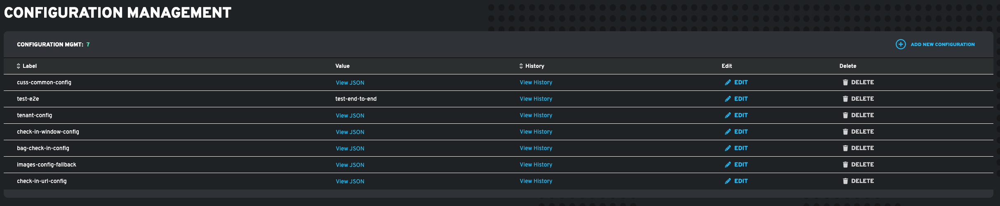
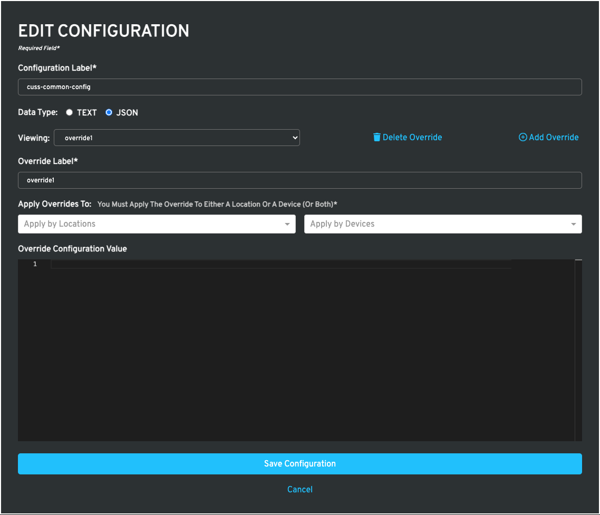

# Elevation Core

<div align="center">
  <h3>Comprehensive TypeScript SDK for Elevated Platform Services</h3>
  <p>Real-time reporting, bidirectional communication, and remote logging for touchpoint devices</p>

[](https://jsr.io/@eai/elevation-core-ts)

</div>

---

## Table of Contents

- [Overview](#overview)
- [Features](#features)
- [Installation & Quick Start](#installation--quick-start)
  - [Node.js/NPM](#nodejs--npm)
  - [Deno](#deno)
- [Core Modules](#core-modules)
  - [Logging](#logging)
  - [Events](#events)
  - [IOT](#iot)
  - [Device Enrollment](#device-enrollment)
  - [Configuration Management](#configuration-management)
  - [Content Management System (CMS)](#content-management-system-cms)
  - [TouchPoint](#touchpoint)
- [API Documentation](#api-documentation)
- [Examples](#examples)
- [Development](#development)
- [Support](#support)

## Overview

The **Elevation Core** library provides comprehensive access to all Elevated Platform core services, enabling seamless
integration with the Elevated ecosystem for device management, monitoring, and analytics. Available for both
**Node.js/NPM** and **Deno** environments.

To interact with the library, developers must acquire an organization token and service endpoint. For more information,
please contact Elevation Software at info@elevationsoftware.com.

### Key Capabilities

- **Real-time Communication**: Bidirectional socket connections for instant device control
- **Event Tracking**: Comprehensive event system with 200+ predefined event codes
- **Centralized Logging**: Remote log aggregation with multiple severity levels
- **Device Enrollment**: Secure device registration and authentication
- **Configuration Management**: Dynamic configuration updates with location/device overrides
- **Content Management**: Multi-language CMS with versioning and scheduled content
- **Smart Debouncing**: Built-in event and log debouncing to prevent flooding
- **TouchPoint Management**: Device service state management

## Features

The core library consists of 7 modules providing comprehensive access to the Elevated Platform Services (EPS):

- **[Logging](#logging)** - Centralized log aggregation and monitoring
- **[Events](#events)** - Event tracking and analytics
- **[IOT](#iot)** - Real-time bidirectional communication
- **[Device Enrollment](#device-enrollment)** - Device registration and configuration
- **[Configuration Management](#configuration-management)** - Dynamic configuration with overrides
- **[Content Management System (CMS)](#content-management-system-cms)** - Multi-language content with versioning
- **[TouchPoint](#touchpoint)** - Device service state management

## Installation & Quick Start

### Node.js / NPM

#### Installation

```bash
npm i @jsr/eai__elevation-core-ts
```

#### Quick Start

```typescript
import { CoreInfo, EventCode, EventsClient, LogsClient } from "@jsr/eai__elevation-core-ts";

const coreInfo: CoreInfo = {
  token: "<Tenant_Access_Token>",
  serviceEndpoint: "https://api-kiosk-elevation.herokuapp.com",
};

// Create service instances
const events = EventsClient.create(coreInfo);
const logs = LogsClient.create(coreInfo);

// Send a log
await logs.information({ message: "Application started", deviceId: "<Device-GUID>" });

// Send an event
await events.success({ eventCode: EventCode.APP_START });
```

### Deno

#### Quick Start

```typescript
import { CoreInfo, EventCode, EventsClient, LogsClient } from "@eai/elevation-core-ts";

const coreInfo: CoreInfo = {
  token: "your-token",
  serviceEndpoint: "https://api-endpoint",
  fingerPrint: "device-id",
};

// Create service instances
const events = EventsClient.create(coreInfo);
const logs = LogsClient.create(coreInfo);

// Send an event
await events.success({
  eventCode: EventCode.APP_START,
  eventData: { version: "1.0.0" },
});

// Send a log
await logs.information({
  message: "Application started",
  deviceId: "device-id",
});
```

#### Deno Development Tasks

```bash
# build
deno fmt
deno lint
deno task build

# Run tests
deno task test
```

## Core Communication

Every service requires specific information needed to communicate with EPS. Each EPS tenant has a unique
access token and endpoint service which are used when creating each service instance. The
interface for the core communication is called CoreInfo.

```typescript
interface CoreInfo {
  token: string;
  serviceEndpoint: string;
  iotEndpoint?: string; // Required for IOT
  iotEvents?: boolean; // Connect to /events namespace instead of /device
  fingerPrint?: string; // Required for IOT/Enrollment/TouchPoint
  secondary?: boolean; // Optional for secondary apps
  timeout?: number; // Request timeout in milliseconds
  version?: string; // CMS content version
  pageName?: string; // CMS page filter
  textReplaces?: { find: string; replace: string }[]; // CMS text replacements
  isDraft?: boolean; // Use draft content (CMS)
}
```

### Defining CoreInfo in code

```typescript
import { CoreInfo } from "@eai/elevation-core-ts";

const coreInfo: CoreInfo = {
  token: "<Tenant_Access_Token>",
  serviceEndpoint: "https://api-kiosk-elevation.herokuapp.com",
};
```

---

# Logging

EPS provides the facility to centralize all the device's logs within the Administration Panel Interface. Users can
access individual device logs through a widget located in the device details page. Logs are displayed in chronological
order and can be filtered based on the available log levels.

## Content

- [Creating a LogsClient](#creating-a-logsclient)
- [Multiple Instances](#log-multiple-instances)
- [Sending Logs](#sending-logs)
- [Log Schema](#log-schema)
- [Log Levels](#log-levels)
- [Setting Logs Defaults](#setting-logs-defaults)
- [Log Helpers](#log-helpers)
- [Log Debounce](#log-debounce)

## Creating a LogsClient

Create a `LogsClient` instance using the static `create` factory method with your `CoreInfo`.

```typescript
import { CoreInfo, LogsClient } from "@eai/elevation-core-ts";

const coreInfo: CoreInfo = {
  token: "<Tenant_Access_Token>",
  serviceEndpoint: "https://api-kiosk-elevation.herokuapp.com",
};

const logs = LogsClient.create(coreInfo);
```

### Log Multiple Instances

In rare occasions, a developer could have multiple service endpoints and want to simultaneously
send logs to all available environments. For that case, create multiple instances.

```typescript
import { CoreInfo, LogsClient } from "@eai/elevation-core-ts";

const coreInfo1: CoreInfo = {
  token: "<Tenant_Access_Token>",
  serviceEndpoint: "https://api-kiosk-elevation.herokuapp.com",
};

const coreInfo2: CoreInfo = {
  token: "<Tenant_Access_Token>",
  serviceEndpoint: "https://<prod-url>",
};

const logs1 = LogsClient.create(coreInfo1);
const logs2 = LogsClient.create(coreInfo2);
```

## Sending logs

After creating a `LogsClient`, you are ready to send log information to EPS.
Each log request should be associated to a unique touchpoint or device, therefore, the use of a `deviceId` is required.

### Log Schema

```typescript
export interface LogData {
  applicationName?: string;
  level?: LogLevel;
  message: string;
  deviceId: string;
  url?: string;
  body?: string;
  statusCode?: number;
}
```

Now in order to send logs, use the `message` method.

```typescript
import { CoreInfo, LogLevel, LogsClient } from "@eai/elevation-core-ts";

const coreInfo: CoreInfo = {
  token: "<Tenant_Access_Token>",
  serviceEndpoint: "https://api-kiosk-elevation.herokuapp.com",
};

const logs = LogsClient.create(coreInfo);

await logs.message({
  applicationName: "MyAwesomeApp",
  level: LogLevel.INFO,
  message: "Application started",
  deviceId: "<Device-GUID>",
  url: "Your App url", // optional
  body: "Request Body", // optional
  statusCode: 0, // optional
});
```

### Log Levels

The library supports 4 different log levels:

```typescript
export enum LogLevel {
  INFO = 0,
  DELAYED = 1,
  ERROR = 2,
  CRITICAL = 3,
}
```

### Setting logs defaults

To improve productivity, you can set default values for properties that don't change
often when sending log messages to EPS.

```typescript
import { CoreInfo, LogLevel, LogOptions, LogsClient } from "@eai/elevation-core-ts";

const coreInfo: CoreInfo = {
  token: "<Tenant_Access_Token>",
  serviceEndpoint: "https://api-kiosk-elevation.herokuapp.com",
};

const logDefaults: LogOptions = {
  debounce: 1000 * 10, // 10 seconds debounce time
  deviceId: "<Device-GUID>",
  applicationName: "MyAwesomeApp",
  statusCode: 0,
};

const logs = LogsClient.create(coreInfo);

// setting default values
logs.setDefaults(logDefaults);

// now only pass the information that is not part of the defaults
await logs.message({
  level: LogLevel.INFO,
  message: "Application started",
});
```

### Log helpers

There is one helper method for each `LogLevel` in the library.

```typescript
logs.information({ message: "Application started" });

logs.delayed({
  url: "https://app_api/submit",
  message: "Request took longer than default values",
});

logs.error({ message: "Unable to submit request" });

logs.critical({ message: "Unable to connect to db" });
```

### Log Debounce

You can define a debounce value in milliseconds. By setting a debounce value, you will prevent the logs library
from sending multiple identical log messages within the debounce time window.

```typescript
import { CoreInfo, LogOptions, LogsClient } from "@eai/elevation-core-ts";

const coreInfo: CoreInfo = {
  token: "<Tenant_Access_Token>",
  serviceEndpoint: "https://api-kiosk-elevation.herokuapp.com",
};

const logDefaults: LogOptions = {
  debounce: 1000 * 10, // 10 seconds debounce time
  deviceId: "<Device-GUID>",
  applicationName: "MyAwesomeApp",
  statusCode: 0,
};

const logs = LogsClient.create(coreInfo);
logs.setDefaults(logDefaults);

// This is going to be sent
logs.information({ message: "Sending message" });

// This won't reach the server (same message within debounce window)
logs.information({ message: "Sending message" });
```

---

# Events

Events are one of the most important elements of EPS, because they drive the information presented in the Administrator
dashboard UI. There are predefined events ready to use in a custom application.

## Content

- [Creating an EventsClient](#creating-an-eventsclient)
- [Multiple Instances](#events-multiple-instances)
- [Sending Events](#sending-events)
- [Events Schema](#events-schema)
- [Event Codes](#event-codes)
- [Event Status Codes](#event-status-codes)
- [Setting Event Defaults](#setting-event-defaults)
- [Event Helpers](#event-helpers)
- [Event Debounce](#event-debounce)

## Creating an EventsClient

Create an `EventsClient` instance using the static `create` factory method with your `CoreInfo`.

```typescript
import { CoreInfo, EventsClient } from "@eai/elevation-core-ts";

const coreInfo: CoreInfo = {
  token: "<Tenant_Access_Token>",
  serviceEndpoint: "https://api-kiosk-elevation.herokuapp.com",
};

const events = EventsClient.create(coreInfo);
```

### Events Multiple Instances

For sending events to multiple environments simultaneously, create multiple instances.

```typescript
import { CoreInfo, EventsClient } from "@eai/elevation-core-ts";

const coreInfo1: CoreInfo = {
  token: "<Tenant_Access_Token>",
  serviceEndpoint: "https://api-kiosk-elevation.herokuapp.com",
};

const coreInfo2: CoreInfo = {
  token: "<Tenant_Access_Token>",
  serviceEndpoint: "https://<prod-url>",
};

const events1 = EventsClient.create(coreInfo1);
const events2 = EventsClient.create(coreInfo2);
```

## Sending events

Use the `send` method to send events to EPS.

### Events schema

```typescript
export interface EventData {
  eventCode?: EventCode | number;
  eventType?: EventType;
  eventMode?: EventMode;
  eventData: EventEventData;
  ownerID?: string;
  statusCode?: StatusCode;
  created?: Date;
  metaData?: EventMetadata;
  tid?: string;
  organization?: string;
}
```

Now you are ready to send an event to EPS.

```typescript
import { CoreInfo, EventCode, EventMode, EventsClient, EventType, StatusCode } from "@eai/elevation-core-ts";

const coreInfo: CoreInfo = {
  token: "<Tenant_Access_Token>",
  serviceEndpoint: "https://api-kiosk-elevation.herokuapp.com",
};

const events = EventsClient.create(coreInfo);

await events.send({
  eventCode: EventCode.BAGTAG_PRINT,
  eventType: EventType.CHECKIN_KIOSK,
  eventMode: EventMode.CUSS,
  eventData: { PNR: "ABC123", airline: "AA" },
  ownerID: "xxxx-xxxx-xxxx-xxxx", // Device GUID
  statusCode: StatusCode.SUCCESS,
});
```

### Event Codes

There are over 200 predefined event codes within the library. Developers are also able to
create custom event codes through the Administrator UI settings.

### Event Status Codes

Each status code represents a way to filter events in the Administrator UI.

```typescript
export enum StatusCode {
  SUCCESS = 200,
  MODE_CHANGE = 300,
  FAILURE = 400,
  CRITICAL_FAILURE = 500,
  INFRACTION = 501,
  TIMEOUT = 502,
}
```

### Setting event defaults

You can define default values that are not likely to change when sending events.
Most of the time the values that rarely change are `eventMode`, `eventType`, and `ownerID`.

```typescript
import { CoreInfo, EventMode, EventOptions, EventsClient, EventType } from "@eai/elevation-core-ts";

const coreInfo: CoreInfo = {
  token: "<Tenant_Access_Token>",
  serviceEndpoint: "https://api-kiosk-elevation.herokuapp.com",
};

const defaultValues: EventOptions = {
  eventType: EventType.CHECKIN_KIOSK,
  eventMode: EventMode.CUSS,
  ownerID: "xxxx-xxxx-xxxx-xxxx", // Device GUID
};

const events = EventsClient.create(coreInfo);
events.setDefaults(defaultValues);

// Now just pass what is not in the default values
await events.send({
  eventCode: EventCode.BAGTAG_PRINT,
  eventData: { PNR: "ABC123", airline: "AA" },
  statusCode: StatusCode.SUCCESS,
});
```

### Event Helpers

The library provides a helper method for each `StatusCode` type:

```typescript
events.success({ eventCode: EventCode.BAGTAG_PRINT });

events.failure({ eventCode: EventCode.BAGTAG_PRINT });

events.error({ eventCode: EventCode.OFFLINE });

events.critical({ eventCode: EventCode.OUT_OF_SERVICE });

events.infraction({ eventCode: EventCode.UPPER_DOOR_OPEN });

events.timeout({ eventCode: EventCode.RESERVATION_NOT_FOUND });

events.modeChange({ eventCode: EventCode.MODE_CHANGE });
```

### Event Debounce

You can define a debounce value in milliseconds on a per `eventCode` basis. This prevents
the event library from sending multiple events of the specified event-code within the debounce time window.

```typescript
import { CoreInfo, EventCode, EventMode, EventOptions, EventsClient, EventType } from "@eai/elevation-core-ts";

const coreInfo: CoreInfo = {
  token: "<Tenant_Access_Token>",
  serviceEndpoint: "https://api-kiosk-elevation.herokuapp.com",
};

// Debouncing all paper jams to 1 minute
const defaultValues: EventOptions = {
  debounceEvent: [{ eventCode: EventCode.PAPER_JAM, debounce: 1000 * 60 }],
  eventType: EventType.CHECKIN_KIOSK,
  eventMode: EventMode.CUSS,
  ownerID: "xxxx-xxxx-xxxx-xxxx",
};

const events = EventsClient.create(coreInfo);
events.setDefaults(defaultValues);

// This event will be sent
events.error({ eventCode: EventCode.PAPER_JAM });

// This will be debounced
events.error({ eventCode: EventCode.PAPER_JAM });
```

There is a chance that you might want to debounce a particular event only once.

```typescript
// Debouncing in-service event once for 1 minute
const defaultValues: EventOptions = {
  debounceOnce: [{ eventCode: EventCode.IN_SERVICE, debounce: 1000 * 60 }],
};
```

You can also add debounce settings programmatically:

```typescript
events.addDebounce([
  { eventCode: EventCode.PAPER_JAM, debounce: 60000 },
  { eventCode: EventCode.NETWORK_ERROR, debounce: 30000 },
]);

events.addDebounceOnce([
  { eventCode: EventCode.IN_SERVICE, debounce: 60000 },
]);

// Clear all debounce settings
events.clearDebounce();

// Reset to initial state (clears debounce and defaults)
events.reset();
```

---

# IOT

The internet of things, provided by EPS, enables applications running anywhere to establish a bidirectional channel of
communication with the Administrator UI. This enables the end user to command the customer facing UI in real time.

## Content

- [Important Notice](#important-notice)
- [FingerPrint](#fingerprint)
- [Creating an IOTConnection](#creating-an-iotconnection)
- [Multiple Instances](#iot-multiple-instances)
- [IOT Event Handling](#iot-event-handling)

### Important notice

Unlike the other services, IOT requires the `iotEndpoint` and a `fingerPrint` to be defined within the CoreInfo Object.
Without them, the communication between the device and EPS won't be possible.

```typescript
interface CoreInfo {
  token: string;
  serviceEndpoint: string;
  iotEndpoint?: string;
  fingerPrint?: string;
}
```

### FingerPrint

In order to associate events and logs to specific devices, EPS requires a form of identification
that must be unique per device. Many applications use the MAC Address or an auto-generated GUID.

There is a helper function in the core library that facilitates the creation of GUIDs:

```typescript
import { uuid } from "@eai/elevation-core-ts";

console.log(uuid()); // example response: e91f29b3-3559-491c-ab43-05c63ddc08f9
```

## Creating an IOTConnection

Create an `IOTConnection` instance using the static `create` factory method. The connection is established automatically
upon creation. You can optionally specify the application name and version.

```typescript
import { CoreInfo, IOTConnection, IOTInfo } from "@eai/elevation-core-ts";

const coreInfo: CoreInfo = {
  token: "<Tenant_Access_Token>",
  serviceEndpoint: "https://api-kiosk-elevation.herokuapp.com",
  iotEndpoint: "https://<app-iot-endpoint>",
  fingerPrint: "<App-GUID>", // unique per touchpoint
  secondary: false, // Optional
};

// optional information
const iotInfo: IOTInfo = {
  appName: "airlineCheckinApp",
  appVersion: "0.1.0",
};

const iot = IOTConnection.create(coreInfo, iotInfo);

// successfully connected to EPS IOT services
iot.on("connected", () => {
  console.log("Connection succeeded");
});

// Device configuration is required
iot.on("configurationRequired", () => {
  console.log("App configuration must be completed to connect");
});
```

### IOT Multiple Instances

For connecting to multiple IOT environments simultaneously, create multiple instances.

```typescript
import { CoreInfo, IOTConnection, IOTInfo } from "@eai/elevation-core-ts";

const coreInfo1: CoreInfo = {
  token: "<Tenant_Access_Token>",
  serviceEndpoint: "https://api-kiosk-elevation.herokuapp.com",
  iotEndpoint: "https://<app-iot-endpoint>",
  fingerPrint: "<App-GUID>",
};

const coreInfo2: CoreInfo = {
  token: "<Tenant_Access_Token>",
  serviceEndpoint: "https://<api-2-endpoint>",
  iotEndpoint: "https://<app-iot-endpoint2>",
  fingerPrint: "<App-GUID>",
};

const iot1 = IOTConnection.create(coreInfo1);
const iot2 = IOTConnection.create(coreInfo2);

iot1.on("connected", () => console.log("Connection 1 succeeded"));
iot2.on("connected", () => console.log("Connection 2 succeeded"));
```

### IOT event handling

There are several events in the IOT lifecycle:

- [connected](#iot-connected)
- [disconnected](#iot-disconnected)
- [configurationRequired](#iot-configurationrequired)
- [command](#iot-command)
- [flightInfo](#iot-flightinfo)
- [event](#iot-event)
- [toast](#iot-toast)
- [refresh](#iot-refresh)
- [onlineKiosks](#iot-onlinekiosks)
- [print](#iot-print)
- [restart](#iot-restart)

### IOT connected

Emitted when the application validates that it is correctly configured and has the correct credentials.
After receiving this event, your application is ready to receive commands.

```typescript
iot.on("connected", () => {
  console.log("Connection succeeded, application is ready to receive commands");
});
```

### IOT disconnected

Emitted when the network connection between the application and the EPS IOT service gets disrupted.

```typescript
iot.on("disconnected", () => {
  console.log("Connection was disrupted, application cannot receive commands");
});
```

### IOT configurationRequired

Emitted when the application connects with a fingerprint never seen before by the IOT service.
The application must go through a configuration process.

```typescript
iot.on("configurationRequired", () => {
  console.log("Connection did not succeed, application must go through the configuration process");
});
```

### IOT command

Enables communication between the developer's application and the EPS IOT services through
a customizable set of device configuration values.

```typescript
iot.on("command", (command: Commands) => {
  if (command.showBagWaiver) {
    console.log("Display waiver to user");
  }
});
```

### IOT flightInfo

Receives flight information data from the server.

```typescript
iot.on("flightInfo", (data) => {
  console.log("Flight info received:", data);
});
```

### IOT event

Receives event data from the server.

```typescript
iot.on("event", (data: EventData) => {
  console.log("Event received:", data);
});
```

### IOT toast

Receives toast notification data from the server.

```typescript
iot.on("toast", (data) => {
  console.log("Toast notification:", data);
});
```

### IOT refresh

Emitted when a refresh command is received from the server.

```typescript
iot.on("refresh", () => {
  console.log("Refresh requested");
});
```

### IOT onlineKiosks

Receives a list of currently online kiosks.

```typescript
iot.on("onlineKiosks", (kiosks: OnlineKiosk[]) => {
  console.log("Online kiosks:", kiosks);
});
```

### IOT print

Receives print data from the server.

```typescript
iot.on("print", (data) => {
  console.log("Print data received:", data);
});
```

### IOT restart

Emitted when a restart command is received from the server.

```typescript
iot.on("restart", () => {
  console.log("Restart requested");
});
```

### Sending messages via IOT

You can send messages back through the IOT connection:

```typescript
// Send a typed message
iot.sendMessage("status", { inService: true });

// Send a structured message
iot.send({ type: "status", data: { inService: true } });
```

### IOT connection management

```typescript
// Check connection status
const isConnected = iot.getConnectionStatus();

// Get socket ID
const socketId = iot.getSocketId();

// Manually reconnect
iot.reconnect();

// Disconnect
iot.disconnect();

// Destroy (disconnect and remove all listeners)
iot.destroy();
```

---

# Device Enrollment

In order to identify every single instance of applications/devices across the globe, developers must complete the
enrollment process. This can be completed through the Administrator UI or by providing the required
information through the library.

## Content

- [FingerPrint](#enrollment-fingerprint)
- [Creating an EnrollmentClient](#creating-an-enrollmentclient)
- [Multiple Instances](#enrollment-multiple-instances)
- [Starting Enrollment](#starting-enrollment)
- [Checking for Unique Labels](#checking-for-unique-labels)

### Enrollment FingerPrint

Similar to the IOT library, in order to configure an instance of the enrollment service, developers must define a unique
fingerprint that would identify a particular instance of an application or a physical device anywhere in the world.

```typescript
import { uuid } from "@eai/elevation-core-ts";

console.log(uuid()); // example response: e91f29b3-3559-491c-ab43-05c63ddc08f9
```

## Creating an EnrollmentClient

Create an `EnrollmentClient` instance using the static `create` factory method. A `fingerPrint` is required in the `CoreInfo`.

```typescript
import { CoreInfo, EnrollmentClient } from "@eai/elevation-core-ts";

const coreInfo: CoreInfo = {
  token: "<Tenant_Access_Token>",
  serviceEndpoint: "https://api-kiosk-elevation.herokuapp.com",
  fingerPrint: "<App-GUID>", // unique per touchpoint
};

const enrollment = EnrollmentClient.create(coreInfo);
```

### Enrollment Multiple Instances

For enrolling devices to multiple environments simultaneously, create multiple instances.

```typescript
import { CoreInfo, EnrollmentClient } from "@eai/elevation-core-ts";

const coreInfo1: CoreInfo = {
  token: "<Tenant_Access_Token>",
  serviceEndpoint: "https://api-kiosk-elevation.herokuapp.com",
  fingerPrint: "<App-GUID>",
};

const coreInfo2: CoreInfo = {
  token: "<Tenant_Access_Token>",
  serviceEndpoint: "https://<api2-url>",
  fingerPrint: "<App-GUID>",
};

const enroll1 = EnrollmentClient.create(coreInfo1);
const enroll2 = EnrollmentClient.create(coreInfo2);
```

## Starting Enrollment

To start the enrollment process, you will receive the current device object reference which you will use for the
enrollment. You also need to retrieve available locations and device specifications.

```typescript
import { CoreInfo, Device, DeviceInfo, DeviceLocation, EnrollmentClient, Specification } from "@eai/elevation-core-ts";

const coreInfo: CoreInfo = {
  token: "<Tenant_Access_Token>",
  serviceEndpoint: "https://api-kiosk-elevation.herokuapp.com",
  fingerPrint: "<App-GUID>",
};

const enrollment = EnrollmentClient.create(coreInfo);

// Starting enrollment process
const [device, locations, specs] = await Promise.all([
  enrollment.start(),
  enrollment.getLocations(),
  enrollment.getSpecification(),
]) as [Device, DeviceLocation[], Specification[]];

// Creating a device object for enrollment
const devObj: DeviceInfo = {
  label: "DENKIOSK001", // a unique name
  device: device,
  location: locations[0],
  terminal: locations[0]?.terminals[0],
  specification: specs[0],
};

await enrollment.enrollDevice(devObj);
```

### Checking for Unique labels

The library enforces that each enrolled device has a unique name/label. You can validate
if a label is available for use before enrolling.

```typescript
import { CoreInfo, EnrollmentClient } from "@eai/elevation-core-ts";

const coreInfo: CoreInfo = {
  token: "<Tenant_Access_Token>",
  serviceEndpoint: "https://api-kiosk-elevation.herokuapp.com",
  fingerPrint: "<App-GUID>",
};

const enrollment = EnrollmentClient.create(coreInfo);

const isAvailable = await enrollment.isLabelAvailable("DENKIOSK001");
if (isAvailable) {
  console.log("It is ok to use that label");
}
```

---

# Configuration Management

The configuration management module allows developers to create custom configurations for their
applications. Configurations can be created through the Administrator UI and retrieved by the application.
These configurations can be set up as global, location, or device specific through the use of overrides.

## Content

- [Configuration UI](#configuration-ui)
- [Creating a ConfigClient](#creating-a-configclient)
- [Multiple Instances](#config-multiple-instances)
- [Retrieving Configurations](#retrieving-configurations)
- [Fetch and Cache Configurations](#fetch-and-cache-configurations)

## Configuration UI





## Creating a ConfigClient

Create a `ConfigClient` instance using the static `create` factory method with your `CoreInfo` and
`ElevatedConfigurationsInfo`.

```typescript
import { ConfigClient, CoreInfo, ElevatedConfigurationsInfo } from "@eai/elevation-core-ts";

const coreInfo: CoreInfo = {
  token: "<Tenant_Access_Token>",
  serviceEndpoint: "https://api-kiosk-elevation.herokuapp.com",
  fingerPrint: "<App-GUID>",
};

const configInfo: ElevatedConfigurationsInfo = {
  deviceId: "<Device-GUID>",
  locationId: "<Location-GUID>",
};

const config = ConfigClient.create(coreInfo, configInfo);
```

### Config Multiple Instances

For connecting to multiple configuration management environments, create multiple instances.

```typescript
import { ConfigClient, CoreInfo, ElevatedConfigurationsInfo } from "@eai/elevation-core-ts";

const coreInfo1: CoreInfo = {
  token: "<Tenant_Access_Token>",
  serviceEndpoint: "https://api-kiosk-elevation.herokuapp.com",
  fingerPrint: "<App-GUID>",
};

const coreInfo2: CoreInfo = {
  token: "<Tenant_Access_Token>",
  serviceEndpoint: "https://<api2-url>",
  fingerPrint: "<App-GUID>",
};

const configInfo: ElevatedConfigurationsInfo = {
  deviceId: "<Device-GUID>",
  locationId: "<Location-GUID>",
};

const config1 = ConfigClient.create(coreInfo1, configInfo);
const config2 = ConfigClient.create(coreInfo2, configInfo);
```

## Retrieving Configurations

To retrieve configurations, provide the configuration label. The configurations resolve with
priority: device > location > global.

```typescript
import { ConfigClient, CoreInfo, ElevatedConfigurationsInfo } from "@eai/elevation-core-ts";

const coreInfo: CoreInfo = {
  token: "<Tenant_Access_Token>",
  serviceEndpoint: "https://api-kiosk-elevation.herokuapp.com",
  fingerPrint: "<App-GUID>",
};

const configInfo: ElevatedConfigurationsInfo = {
  deviceId: "<Device-GUID>",
  locationId: "<Location-GUID>",
};

const config = ConfigClient.create(coreInfo, configInfo);

// Retrieve a single configuration
const value = await config.getConfig("config-key");

// Retrieve a list of configurations
const values = await config.getConfigs(["config-key-1", "config-key-2"]);
```

## Fetch and Cache Configurations

The `fetchAndCacheConfig` method fetches a configuration from the server, compares it against a local `.jsonc` file,
and writes the result to disk if the configuration has changed. It supports backup rotation.

```typescript
const result = await config.fetchAndCacheConfig({
  label: "app-settings",
  filePath: "./config/app-settings.jsonc",
  force: false, // Optional: force write even if unchanged
  maxBackups: 3, // Optional: number of backup files to keep (default: 3)
});

console.log(result.updated); // true if file was written
console.log(result.firstFetch); // true if no prior local file existed
console.log(result.data); // the configuration data
```

---

# Content Management System (CMS)

The CMS module provides a content management system with multi-language support, versioning, scheduled content delivery, and intelligent caching. This enables applications to retrieve localized strings and configuration objects dynamically from the Elevated Platform.

## Content

- [CMS Overview](#cms-overview)
- [Creating a CMSClient](#creating-a-cmsclient)
- [Multiple Instances](#cms-multiple-instances)
- [Getting Content](#getting-content)
- [Content Strings](#content-strings)
- [Configuration Objects](#configuration-objects)
- [Language Fallback](#language-fallback)
- [Cache Management](#cache-management)
- [Version Support](#version-support)
- [Draft Mode](#draft-mode)

## CMS Overview

The CMS module enables applications to:

- **Multi-language Support**: Retrieve content in multiple languages with automatic fallback
- **Content Versioning**: Support for base and custom versions with scheduled display dates
- **Configuration Storage**: Store and retrieve JSON configuration objects
- **Intelligent Caching**: In-memory caching with cache control
- **Draft/Published States**: Support for draft and published content workflows
- **Scheduled Content**: Display content based on date ranges
- **Text Replacements**: Automatic find/replace on CMS strings via `coreInfo.textReplaces`

## Creating a CMSClient

Create a `CMSClient` instance using the static `create` factory method.

```typescript
import { CMSClient, CoreInfo } from "@eai/elevation-core-ts";

const coreInfo: CoreInfo = {
  token: "<Tenant_Access_Token>",
  serviceEndpoint: "https://api-kiosk-elevation.herokuapp.com",
  version: "v2.0", // Optional: specify content version
  isDraft: false, // Optional: use draft or published content
};

const cms = CMSClient.create(coreInfo);
```

### CMS Multiple Instances

For applications that need to access multiple CMS environments simultaneously:

```typescript
import { CMSClient, CoreInfo } from "@eai/elevation-core-ts";

const coreInfo1: CoreInfo = {
  token: "<Tenant_Access_Token>",
  serviceEndpoint: "https://api-kiosk-elevation.herokuapp.com",
};

const coreInfo2: CoreInfo = {
  token: "<Tenant_Access_Token>",
  serviceEndpoint: "https://<prod-url>",
};

const cms1 = CMSClient.create(coreInfo1);
const cms2 = CMSClient.create(coreInfo2);
```

## Getting Content

The CMS provides multiple methods for retrieving content based on your needs.

### Content Strings

Use `getString()` or `getKey()` to retrieve localized text strings:

```typescript
import { CMSClient } from "@eai/elevation-core-ts";

// Get a localized string
const welcomeMsg = await cms.getString("welcome_message", "en-US");
console.log(welcomeMsg); // "Welcome to our service"

// Get string in Spanish
const spanishMsg = await cms.getString("welcome_message", "es-ES");
console.log(spanishMsg); // "Bienvenido a nuestro servicio"

// Get string without cache (force fresh data)
const freshMsg = await cms.getString("welcome_message", "en-US", false);
```

### Multiple Content Strings

Use `getKeys()` to retrieve multiple localized strings in a single call:

```typescript
const keys = ["welcome_message", "goodbye_message", "error_message"];
const messages = await cms.getKeys(keys, "en-US");

console.log(messages);
// ["Welcome to our service", "Goodbye!", "An error occurred"]

// Get multiple strings without cache
const freshMessages = await cms.getKeys(keys, "en-US", false);
```

### Available Languages

Use `getLangs()` to retrieve all available language codes from the CMS:

```typescript
const languages = await cms.getLangs();
console.log(languages); // ["en-US", "es-ES", "fr-FR", "de-DE"]

// Get languages without cache (force fresh data)
const freshLanguages = await cms.getLangs(false);
```

### Configuration Objects

Use `getConfig()` to retrieve JSON configuration objects that are automatically parsed:

```typescript
const themeConfig = await cms.getConfig("app_theme_config", "en-US");
console.log(themeConfig);
// {
//   primaryColor: "#007bff",
//   secondaryColor: "#6c757d",
//   fontSize: 16
// }
```

### Language Fallback

The CMS automatically falls back to `en-US` when content is not available in the requested language:

```typescript
// Request content in French
const frenchMsg = await cms.getString("welcome_message", "fr-FR");
// If French version doesn't exist, returns en-US version automatically
```

## Cache Management

The CMS includes built-in caching for improved performance.

### Loading All Strings

Pre-load all CMS strings into memory:

```typescript
// Load all strings with caching
await cms.loadAllStrings();

// Force reload without cache
await cms.loadAllStrings(true);
```

### Cache Statistics

Get information about the current cache state:

```typescript
const stats = cms.getCacheStats();
console.log(`Cache has ${stats.size} entries`);
console.log(`Cache keys:`, stats.keys);
```

### Clearing Cache

Clear the cache to force fresh data retrieval:

```typescript
cms.clearCache();
```

### Getting All Strings

Access all loaded strings directly:

```typescript
const allStrings = cms.getAllStrings();
if (allStrings) {
  console.log(`Loaded ${allStrings.length} CMS entries`);
}
```

## Version Support

The CMS supports content versioning. By default, the CMS uses the "base" version, but you can specify a different version using `coreInfo.version`.

### Configuring a Specific Version

```typescript
import { CMSClient, CoreInfo } from "@eai/elevation-core-ts";

const coreInfo: CoreInfo = {
  token: "<Tenant_Access_Token>",
  serviceEndpoint: "https://api-kiosk-elevation.herokuapp.com",
  version: "holiday-2024",
};

const cms = CMSClient.create(coreInfo);

// Content will be retrieved from "holiday-2024" version
const holidayMsg = await cms.getString("welcome_message", "en-US");
```

### Version Fallback Behavior

When a specific version is configured:

1. The CMS first looks for the specified version (e.g., "holiday-2024")
2. If the version exists but is outside its scheduled display dates, falls back to "base" version
3. If the version doesn't exist for a particular key, falls back to "base" version

### Scheduled Content

Versions can have display date ranges. Content is automatically selected based on the current date:

- If a version has `displayDates` defined, content is only shown within the specified date range
- If current date is outside the range, falls back to base version
- This enables time-based content scheduling without code changes

## Draft Mode

Support for draft content allows testing changes before publishing. Set `coreInfo.isDraft` to `true` to retrieve draft (unpublished) content.

### Configuring Draft Mode

```typescript
import { CMSClient, CoreInfo } from "@eai/elevation-core-ts";

const coreInfo: CoreInfo = {
  token: "<Tenant_Access_Token>",
  serviceEndpoint: "https://api-kiosk-elevation.herokuapp.com",
  version: "v2.0",
  isDraft: true,
};

const cms = CMSClient.create(coreInfo);

// Retrieves draft content from the specified version
const draftContent = await cms.getString("welcome_message", "en-US");
```

### Draft vs Published

- **Draft Mode (`isDraft: true`)**: Returns the latest draft version string directly from the version data
- **Published Mode (`isDraft: false` or omitted)**: Returns the last published version from the `publishes` array

### Cleanup

When done with the CMS service, clean up resources:

```typescript
cms.destroy();
```

---

# TouchPoint

The TouchPoint module enables applications to manage device service state — setting devices in or out of service
and retrieving device information by fingerprint.

## Content

- [Creating a TouchPointClient](#creating-a-touchpointclient)
- [Getting Device Info](#getting-device-info)
- [Service State Management](#service-state-management)

## Creating a TouchPointClient

Create a `TouchPointClient` instance using the static `create` factory method.
A `fingerPrint` is required in the `CoreInfo`.

```typescript
import { CoreInfo, TouchPointClient } from "@eai/elevation-core-ts";

const coreInfo: CoreInfo = {
  token: "<Tenant_Access_Token>",
  serviceEndpoint: "https://api-kiosk-elevation.herokuapp.com",
  fingerPrint: "<App-GUID>",
};

const touchpoint = TouchPointClient.create(coreInfo);
```

## Getting Device Info

Retrieve the complete device information for the configured fingerprint:

```typescript
const device = await touchpoint.getInfo();
if (device) {
  console.log("Device label:", device.label);
  console.log("Device location:", device.location);
}
```

## Service State Management

Set the device in or out of service:

```typescript
// Set device in service
await touchpoint.inService(true, "Application started");

// Set device out of service
await touchpoint.inService(false, "Maintenance required");
```

---

## API Documentation

### Core Interfaces

#### CoreInfo

```typescript
interface CoreInfo {
  token: string; // Tenant access token
  serviceEndpoint: string; // API endpoint
  iotEndpoint?: string; // IOT service endpoint
  iotEvents?: boolean; // Connect to /events namespace
  fingerPrint?: string; // Unique device identifier
  secondary?: boolean; // Secondary app flag
  timeout?: number; // Request timeout in milliseconds
  version?: string; // CMS content version
  pageName?: string; // CMS page filter
  textReplaces?: { find: string; replace: string }[]; // CMS text replacements
  isDraft?: boolean; // Use draft content (CMS)
}
```

#### EventData

```typescript
interface EventData {
  eventCode?: EventCode | number;
  eventType?: EventType;
  eventMode?: EventMode;
  eventData: EventEventData;
  ownerID?: string;
  statusCode?: StatusCode;
  created?: Date;
  metaData?: EventMetadata;
  tid?: string;
  organization?: string;
}
```

#### LogData

```typescript
interface LogData {
  applicationName?: string;
  level?: LogLevel;
  message: string;
  deviceId: string;
  url?: string;
  body?: string;
  statusCode?: number;
}
```

#### IOTInfo

```typescript
interface IOTInfo {
  appName: string;
  appVersion?: string;
}
```

#### DeviceInfo

```typescript
interface DeviceInfo {
  label: string;
  device: Device;
  location: DeviceLocation;
  terminal: Terminal;
  specification: Specification;
  metadata?: DeviceMetadata;
}
```

#### ElevatedConfigurationsInfo

```typescript
interface ElevatedConfigurationsInfo {
  deviceId: string;
  locationId: string;
  version?: string;
}
```

---

## Examples

### Complete Integration Example

```typescript
import {
  CMSClient,
  ConfigClient,
  CoreInfo,
  ElevatedConfigurationsInfo,
  EnrollmentClient,
  EventCode,
  EventMode,
  EventsClient,
  EventType,
  IOTConnection,
  IOTInfo,
  LogsClient,
  TouchPointClient,
} from "@eai/elevation-core-ts";

async function main() {
  const coreInfo: CoreInfo = {
    token: Deno.env.get("ELEVATION_TOKEN")!,
    serviceEndpoint: Deno.env.get("ELEVATION_SERVICE_ENDPOINT")!,
    iotEndpoint: Deno.env.get("ELEVATION_IOT_ENDPOINT"),
    fingerPrint: Deno.env.get("ELEVATION_FINGERPRINT"),
  };

  // Create service instances
  const events = EventsClient.create(coreInfo);
  const logs = LogsClient.create(coreInfo);

  // Set defaults
  events.setDefaults({
    eventType: EventType.CHECKIN_KIOSK,
    eventMode: EventMode.NATIVE,
    ownerID: coreInfo.fingerPrint,
  });

  logs.setDefaults({
    deviceId: coreInfo.fingerPrint!,
    applicationName: "MyKioskApp",
  });

  // Configure IOT if available
  if (coreInfo.iotEndpoint && coreInfo.fingerPrint) {
    const iotInfo: IOTInfo = {
      appName: "MyKioskApp",
      appVersion: "1.0.0",
    };

    const iot = IOTConnection.create(coreInfo, iotInfo);

    iot.on("connected", () => {
      console.log("IOT Connected");
      events.success({ eventCode: EventCode.ONLINE });
    });

    iot.on("command", (command) => {
      console.log("Received command:", command);
      if (command.refresh) {
        console.log("Refreshing application...");
      }
    });
  }

  // Send startup events and logs
  await events.success({
    eventCode: EventCode.APP_START,
    eventData: { version: "1.0.0" },
  });

  await logs.information({
    message: "Application started successfully",
  });

  // TouchPoint service state
  if (coreInfo.fingerPrint) {
    const touchpoint = TouchPointClient.create(coreInfo);
    await touchpoint.inService(true, "Application started");
  }

  console.log("Elevation library initialized successfully!");
}

main().catch(console.error);
```

### Event Debouncing

```typescript
const events = EventsClient.create(coreInfo);

events.setDefaults({
  debounceEvent: [
    { eventCode: EventCode.PAPER_JAM, debounce: 60000 },
    { eventCode: EventCode.NETWORK_ERROR, debounce: 30000 },
  ],
  debounceOnce: [
    { eventCode: EventCode.IN_SERVICE, debounce: 60000 },
  ],
});
```

### Configuration Management

```typescript
const configInfo: ElevatedConfigurationsInfo = {
  deviceId: "<Device-GUID>",
  locationId: "<Location-GUID>",
};

const config = ConfigClient.create(coreInfo, configInfo);

// Retrieve a configuration
const settings = await config.getConfig("theme_settings");

// Fetch and cache to disk
const result = await config.fetchAndCacheConfig({
  label: "app-settings",
  filePath: "./config/app-settings.jsonc",
});
```

---

## Development

### Project Structure

```
elevation-core-ts/
├── lib/              # Core library modules
│   ├── shared/       # Base classes & utilities
│   ├── events.ts     # Event tracking (EventsClient)
│   ├── logs.ts       # Centralized logging (LogsClient)
│   ├── iot.ts        # WebSocket communication (IOTConnection)
│   ├── enrollment.ts # Device registration (EnrollmentClient)
│   ├── config.ts     # Configuration management (ConfigClient)
│   ├── cms.ts        # Content management (CMSClient)
│   └── touchpoint.ts # Device service state (TouchPointClient)
├── types/            # TypeScript definitions & enums
├── mod.ts            # Main library exports
└── deno.json         # Deno configuration
```

### Development Tasks

```bash
# Build
deno task build

# Run tests
deno task test
```

### Environment Setup

Create a `.env` file for local development:

```env
ELEVATION_TOKEN=your_tenant_access_token
ELEVATION_SERVICE_ENDPOINT=https://api-kiosk-elevation.herokuapp.com
ELEVATION_IOT_ENDPOINT=wss://iot-elevation.herokuapp.com
ELEVATION_FINGERPRINT=device-unique-id
```

---

## Support

For support and questions:

- Contact: [Elevation Software](https://www.blndspt.com/reach-out/)
- Issues: [GitHub Issues](https://github.com/elevationsoftware/elevation-lib-core/issues)
- Documentation: [API Docs](https://elevationsoftware.github.io/elevation-lib-core)

## License

BUSL-1.1 - Elevation Software

---

<div align="center">
  <p>Built by <a href="https://www.blndspt.com">Elevation Software</a></p>
</div>
